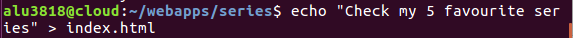
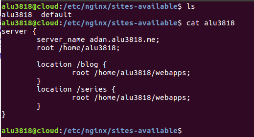
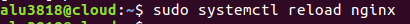
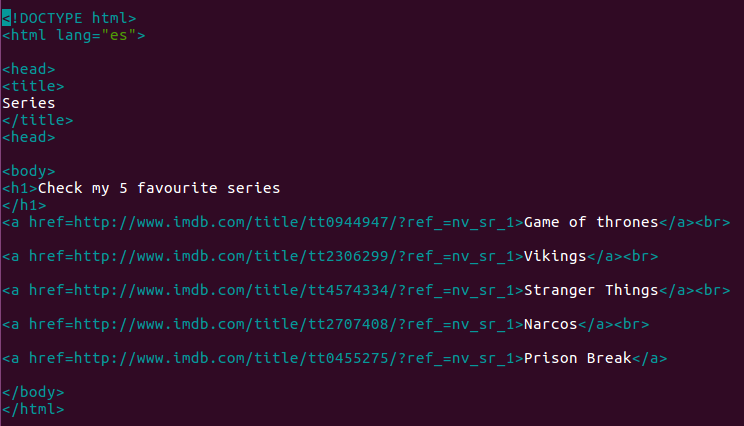
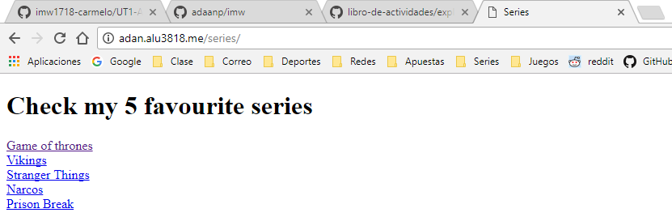

# Mis series favoritas.

-  Inicio
  - Dentro de la máquina de producción, creamos las carpetas y archivos *html* necesarios.

   - Pongo cualquier línea de texto dentro, para tenerla escrita y luego seguir escribiendo.

  - Dentro de la carpeta del servidor **nginx** tenemos que modificar un archivo *server*, introduciendo *nombre de la página web, root y locations.*

  - Reiniciamos el servidor *Nginx*

  - Y modificamos por último, el archivo *html* donde tenemos la "página web".
  

-   Resultado

# Link: http://alu3818.me/series/
