# UT4-A1: Implantación de Wordpress

---

## Realizar la instalación de Wordpress en el dominio wordpress.alu3818.me

* Wordpress necesita un usuario/contraseña para acceder a una base de datos. Para ello, usaremos el intérprete de MySQL:

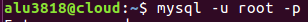

* Tenemos que crear la base de datos, el usuario y asignar privilegios:

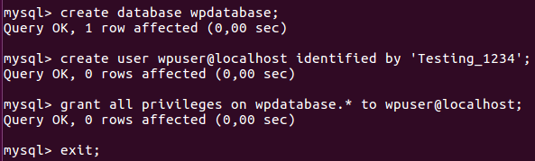

* Descargamos el código fuente de Wordpress desde su página web:

* Lo descomprimimos.

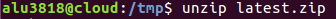

* Y lo copiamos a `/usr/share`, estableciendo también los permisos necesarios.

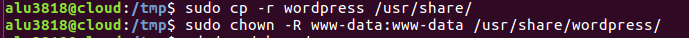

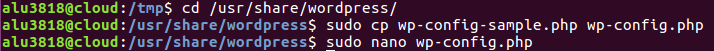

* Básicamente, debemos especificar el nombre de la base de datos, el usuario y la contraseña, para que Wordpress pueda usarlos:

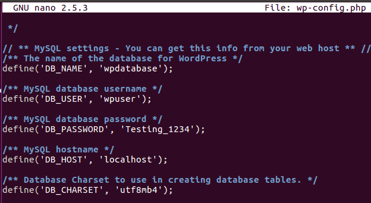

* Para que nuestro sitio Wordpress sea accesible desde un navegador web, debemos incluir las directivas necesarias en la configuración del servidor web Nginx.
  * Supongamos que queremos acceder a nuestro Wordpress desde la url wordpress.alu3818.me. Para ello tendremos que crear un nuevo virtual host de la siguiente manera:

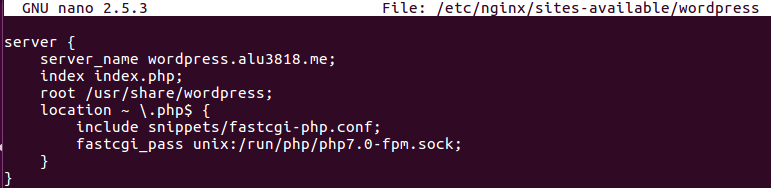

* Enlazamos con `sites-enabled`

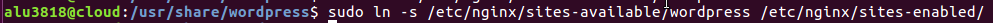

* Y reiniciamos el servicio.

* Una vez esto, ya podemos instalar **Wordpress**.
  * Para ello accedemos al navegador mediante `wordpress.alu3818.me` y elegimos el idioma, nombre/contraseña y correo.

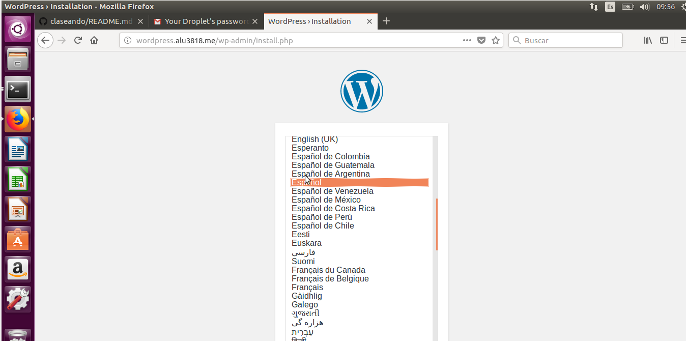

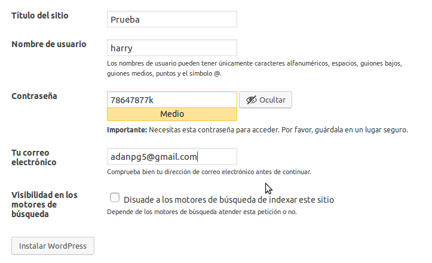

* Y ya tenemos wordpress instalado y configurado.

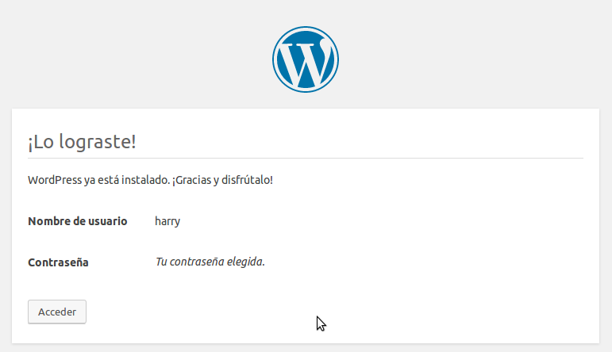

---

## Ajustar los permalinks a Día y Nombre.

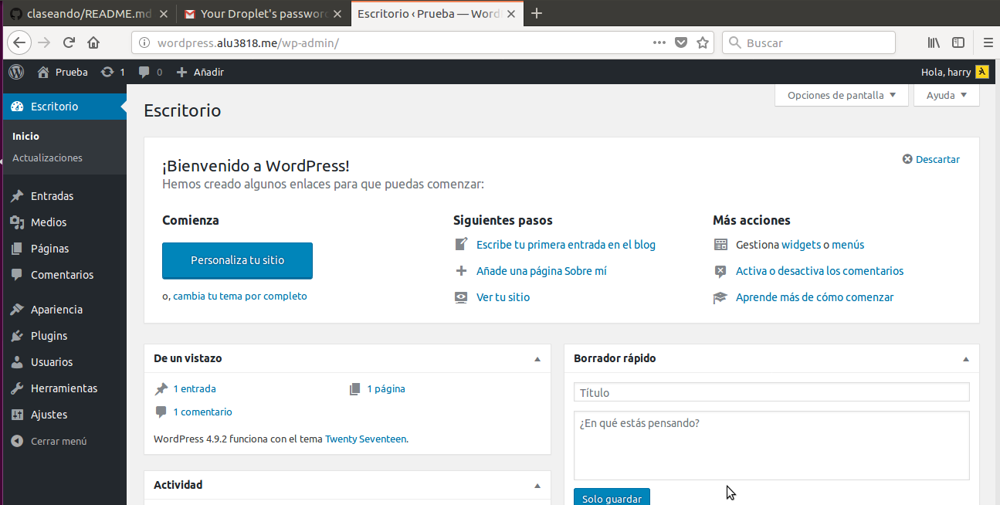

* En primer lugar, nos dirigimos a *Ajustes -> Enlaces permanentes* y activamos esta opción dentro de la interfaz administrativa de Wordpress:

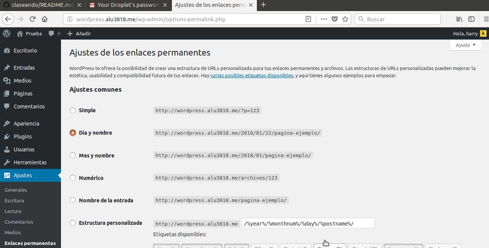

* Ahora debemos indicar a Nginx que procese estas URLs:

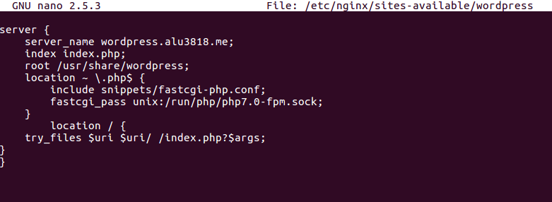

---

## Instalar y activar un tema gratuito.

* En la pestaña <Kbd>Apariencia</kbd> -> <Kbd>Temas</kbd> buscamos uno que nos guste. Clickamos sobre el, y le pulsamos **Instalar**.

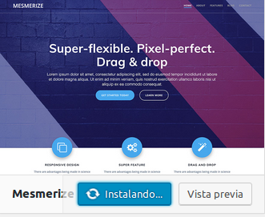

* Cuando finalice, clickamos esta vez en **Activar**.

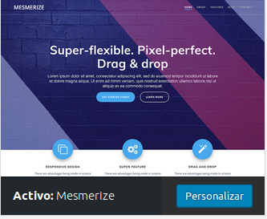

---

## Escribir un post con las estadísticas de uso de Wordpress vistas en clase y entrar a dicho post.

* En la sección <Kbd>Entradas</kbd> podemos crear nuestros posts.
  * Para hacer uno nuevo vamos a *Añadir nuevo*, le ponemos un título y a continuación el texto que nosotros queramos publicar.
  * Pulsamos sobre <Kbd>Publicar</kbd>.

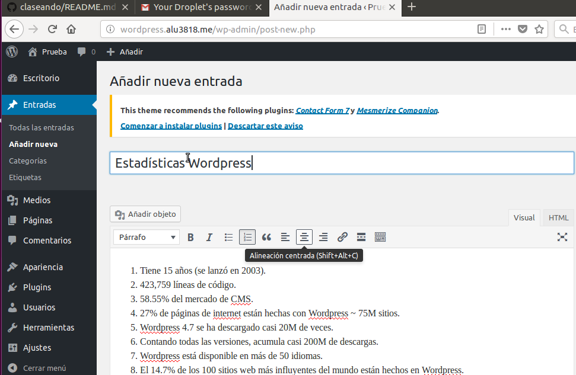

* Ya podemos ver nuestra primera publicación.

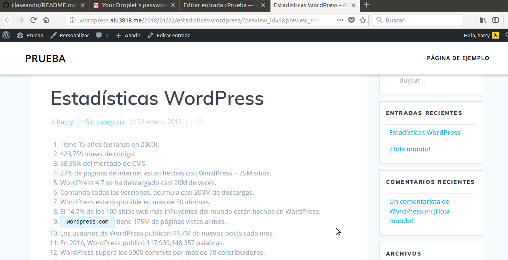

---
