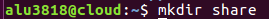
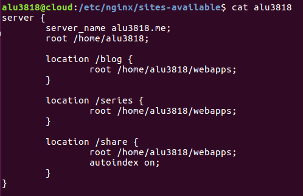
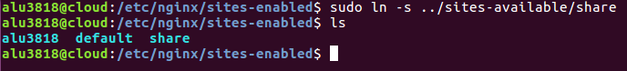
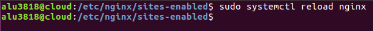
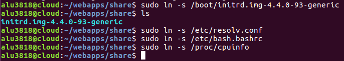
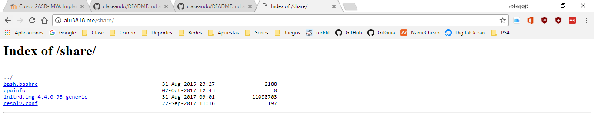

# Listado de directorios.

- Creamos la carpeta *share* en **home/alu3818/webapps** para compartir los archivos.

- Editamos el archivo **/etc/nginx/sites-available/alu3818** para introducir un nuevo *location* donde irá la carpeta *share*.

- Creamos el enlace simbólico del archivo en **sites-enabled**.

- Y recargamos el servicio nginx.

- Ahora, dentro de la carpeta */webapps/share* creamos los enlaces simbólicos a los archivos que queremos subir a la página *compartida*

- Resultado

# **LINK** **http://alu3818.me/share/**
