# Trabajo con *virtual-hosts*

* La actividad consiste en configurar 4 sitios web (virtual hosts) en nuestro servidor web Nginx.

# Página 1. - http://imw.alu3818.me/

* Nos dirigimos a la carpeta `/etc/nginx/sites-available`, que es donde creamos el *virtual host*.
* Creamos el archivo llamada **imw**, y en él introducimos el *nombre de servidor* y la *ruta* donde tendremos el cuerpo de la página.

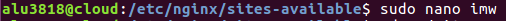

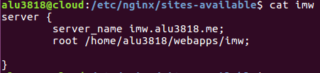

* Con un `cd ../sites-enabled` nos dirigimos a la carpeta de sitios activos, donde haremos el enlace simbólico del servidor de *sites-available*.
  - Utilizamos `sudo ln -s ../sites-available/imw` para crear dicho enlace.

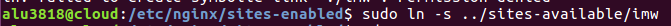

* En la carpeta */home/alu3818/webapps* es donde pondremos todos los cuerpos de nuestras webs, o los **index**.
  - Creamos la carpeta **imw**.

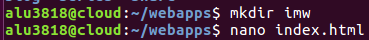

* Dentro de la carpeta *imw* creamos un html, y ponemos un enlace a la imagen que vamos a mostrar en nuestra web.

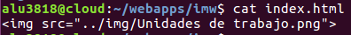

* Hacemos un `sudo systemctl reload nginx.service` para recargar el servicio y entramos a dicha página en el navegador, y se mostraría la imagen.

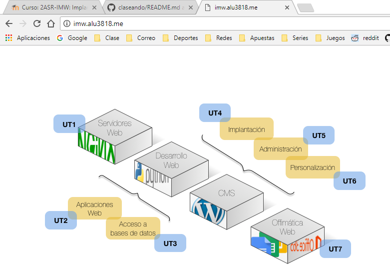

* Para hacer una **subweb**, añadimos un *location* en el archivo del server, que quedaría de esta forma.

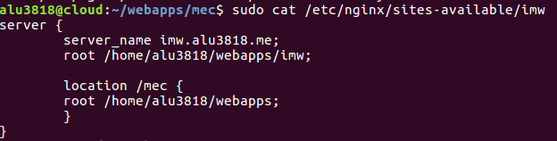

* Y volvemos a crear la carpeta con el nombre de la *subweb* en *webapps*

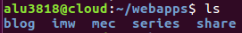

* Ponemos el contenido que queremos dentro de dicha carpeta.

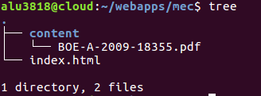

* Editamos el index para que tenga una forma dentro del navegador.

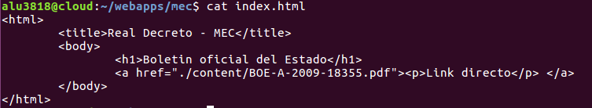

* Y volvemos a *reiniciar* el servicio.

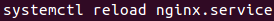

* Si entramos en http://imw.alu3818.me/mec, vemos que ya está la página que hicimos.

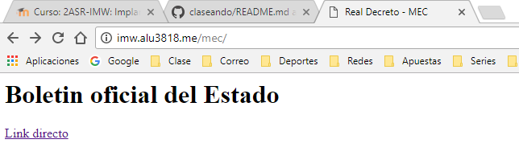

# Página 2. - http://varlib.alu3818.me:9000

* Vamos a *sites-available* y creamos un archivo llamado **varlib**.
  - Añadimos el puerto que va a escuchar, que nosotros elegiremos el **9000**.
  - La ruta de los archivos que queremos mostrar.
  - Un autoindex, para que lo indexe todo con órden.

* Creamos el enlace simbólico en *sites-enabled* de lo anterior.

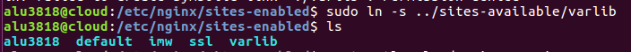

* Y recargamos el servicio nginx.

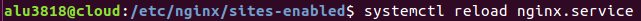

* Utilizando [este enlace](http://varlib.alu3818.me:9000) entramos en la página resultado.

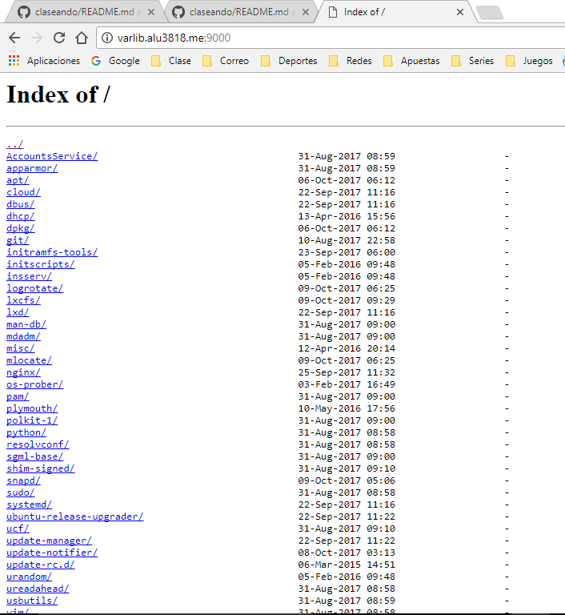

# Página 3. - https://ssl.alu3818.me/students/

* Vamos a acceder a esta web con *Usuario y contraseña*, para ello creamos una contraseña encriptada de *aula108*.
  - La contraseña encriptada la metemos dentro de un archivo de texto con el nombre del usuario.

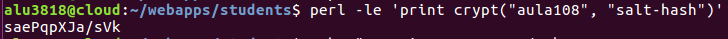

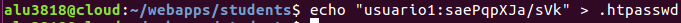

* Volvemos a **sites-available** y creamos su archivo.
En este caso tendremos que añadir líneas nuevas, como el *auth_basic y el auth_basic_user_file* para poner el archivo de la contraseña y el usuario.
  - El usuario es `usuario1`.
  - La contraseña es `aula108`.

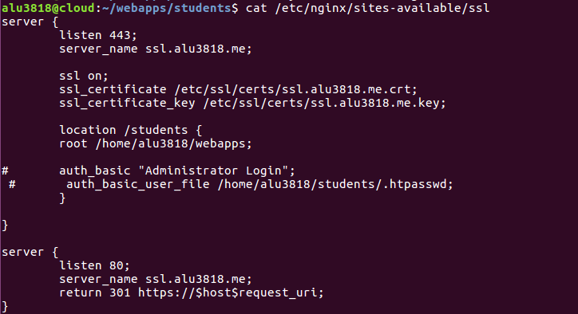

* Introducimos las credenciales al entrar en la página
https://ssl.alu3818.me/students/ y ya entraríamos.

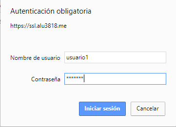

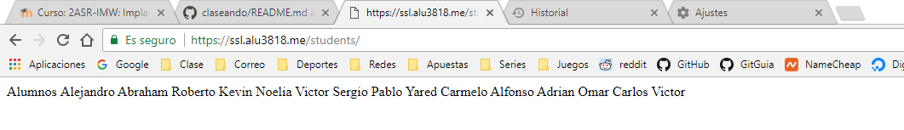

# Página 4. - http://redirect.alu3818.me

* Descargamos en la moodle el archivo que vamos a utilizar en nuestra web, pero en la máquina producción.

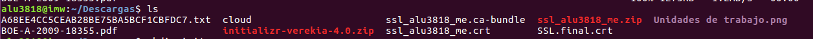

* Lo descomprimimos.

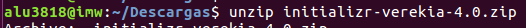

* Y lo mandamos por `scp` a la máquina de desarrollo, al *cloud*.

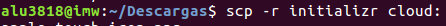

* Desde la carpeta en la que lo tengamos, tenemos que llevarlo hacia `webapps/target` que es donde tendremos la ruta hacia el servidor.

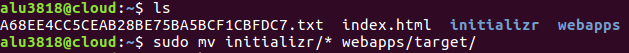

* En *sites-available* creamos dos archivos, uno como `redirect` y otro como `target`.
  * En el **redirect**, realizaremos las **redirecciones**, es decir, nosotros queremos que nos redireccione desde *redirect.alu3818.me* a *target.alu3818.me*.
  * De la misma manera queremos que nos reenvíe desde *www.redirect.alu3818.me* a *target.alu3818.me*.

* En el **target**, escucharemos desde el puerto 80, le damos el nombre de servidor, y la ruta hacia los archivos que va a tener nuestra página web (*webapps/target*).

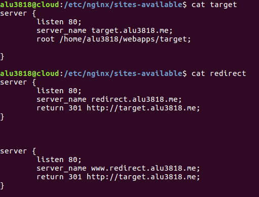

* Y ya por último, entrando desde http://redirect.alu3818.me
o desde http://www.redirect.alu3818.me entraríamos a la web final.

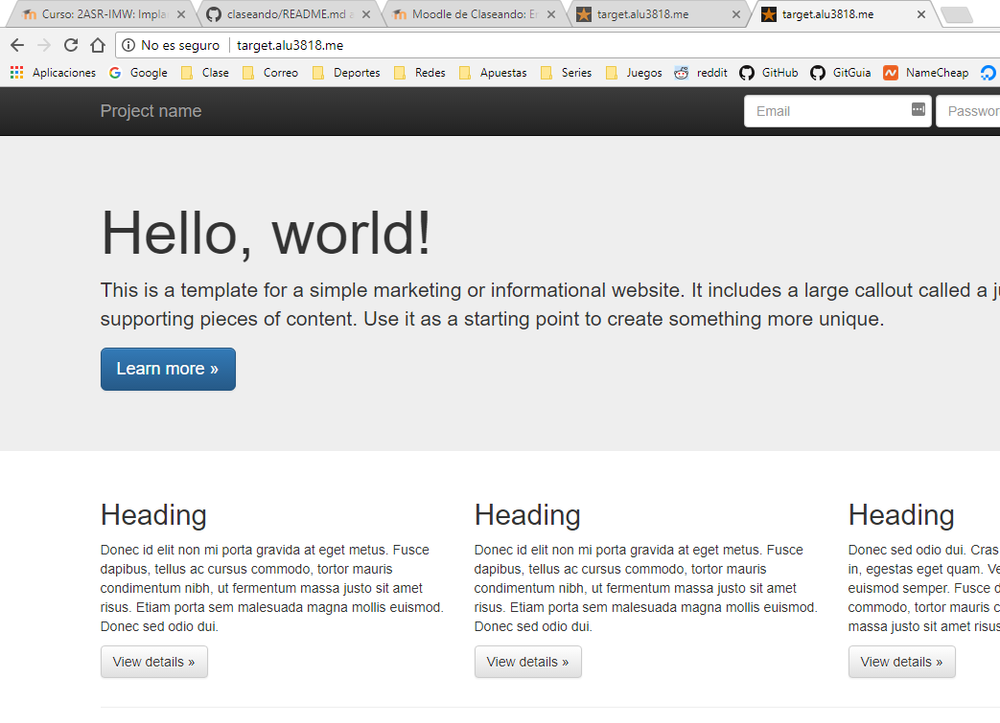

# Enlaces directos a las webs.

WEB | Enlace | :octocat:
 ------------ | ------------- | ------------
Primera | [Enlace](http://imw.alu3818.me/)  | :+1:
Segunda | [Enlace](http://varlib.alu3818.me:9000) | :+1:
Tercera | [Enlace](https://ssl.alu3818.me/students/) | :+1:
Cuarta  | [Enlace sin www](http://redirect.alu3818.me) / [Enlace con www](http://www.redirect.alu3818.me) | :+1:)
