# Sirviendo aplicaciones con *PHP y Python*

---

* La actividad consiste en configurar 2 sitios web (virtual hosts) en nuestro servidor web Nginx utilizando PHP y Python.

---

## Página 1. - http://php.alu3818.me/

* Lo primero, es crear el archivo del servidor en `/etc/nginx/sites-available` con el nombre que nosotros queramos, que en mi caso le puse **php**.
  * Y lo siguiente es rellenarlo con los datos de **server_name** y la **ruta** por defecto donde tenemos los contenidos.

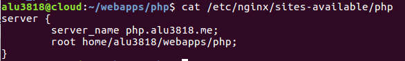

* Nos vamos a la carpeta `/etc/nginx/sites-enabled` y creamos un enlace simbólico utilizando `ln -s ./etc/nginx/sites-available/php`.

* Recargamos el servicio para que surja efecto.

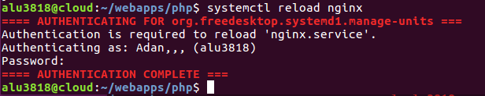

* En la ruta que pusimos en el servidor, debemos tener una carpeta con los archivos necesarios para tener la web.
  * En nuestro caso tenemos unos archivos que nos descargamos desde la web implantada por el profesor.

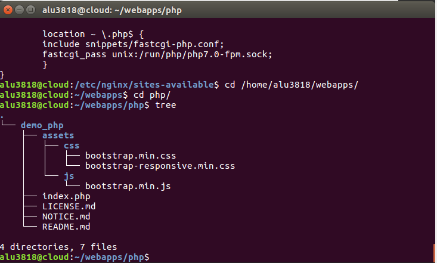

* Lo siguiente será buscar en el navegador la web: **php.alu3818.me**.
  * Y comprobamos que está bien hecho.

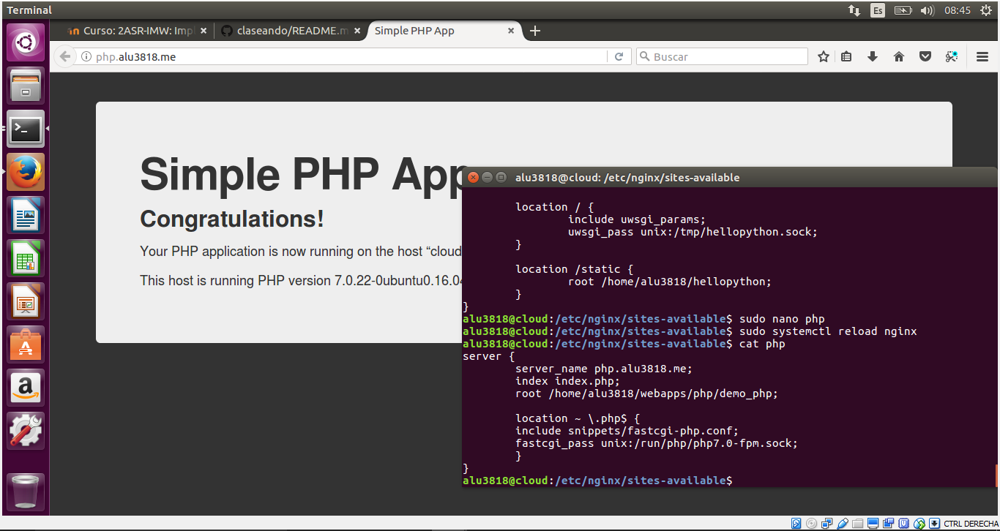

---

## Página 2. - http://now.alu3818.me/

* Creamos el host virtual, llamado **now** y en este caso tenemos que añadir unos parámetros para especificarle a *Nginx* que utilizaremos python y otro location para la ruta de nuestra página.

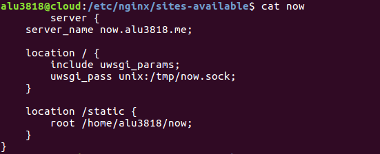

* Hacemos su enlace simbólico en la carpeta `etc/nginx/sites-enabled`

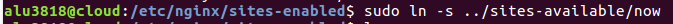

* Y ahora procedemos a crear el entorno virtual.
  * Para ello, utilizaremos el comando `virtualenv .(Carpeta-donde-lo-queremos)/(Nombre-virtual-host)`

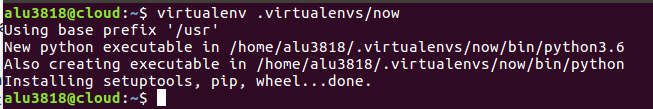

* Entramos dentro del entorno virtual utilizando `source .virtualenvs/now/bin/activate`

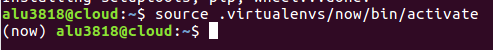

* Instalamos los paquetes **UWSGI** para poder sincronizar python con nginx.

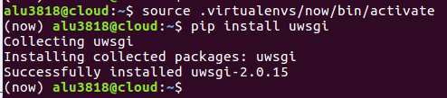

* Instalamos a su vez la herramienta *flask*.

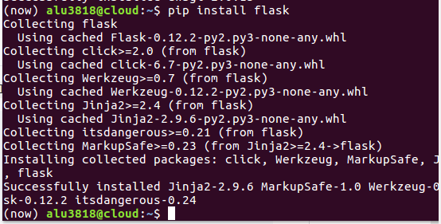

* Una vez tengamos preparado el entorno, creamos la carpeta *now*, donde pondremos los archivos de configuración y el main.

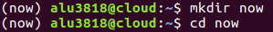

* Nuestro main tendrá la siguiente forma, ya que queremos que muestre una aplicación web con el día y la hora actual.

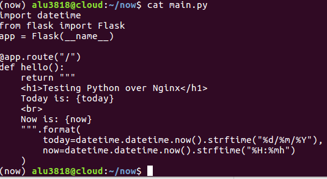

* Tenemos que crear un ejecutable para que active el entorno virtual y el uwsgi de una manera más sencilla y cómoda, para no estar escribiendo dichos comandos.
  - Lo llamaremos *run.sh* y tendremos que darle permisos de ejecución.

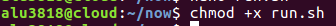

* Dentro del run.sh introduciremos los comandos que queremos ejecutar.

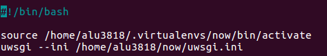

* El archivo uwsgi.ini que se ejecutará con el run.sh tendrá la siguiente configuración.

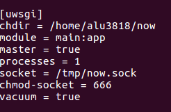

* Si ejecutamos el run.sh con el comando `./run.sh` y nos dirigimos a now.alu3818.me veremos como ya funciona correctamente.

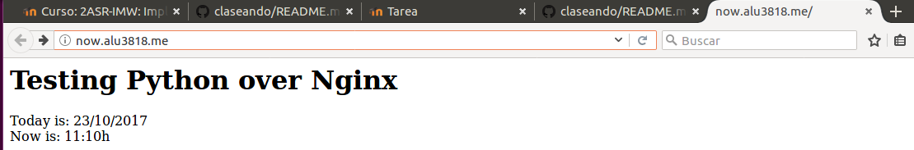

* Pero claro, no siempre podremos estar en la máquina para ejecutar el run.sh, y sin dicho ejecutable nuestra página no funcionaría.
  - Podemos proceder a instalar una herramienta que nos proporciona, como su propio nombre indica, *supervisión*.
  - La herramienta *supervisor* mantendrá activo nuestro run.sh aunque nosotros no lo activemos.

* Lo siguiente es ir al archivo de configuración de supervisor y crear una *supervisión* por así decirlo a nuestro run.sh.
  * Lo configuraremos de manera que:
    * El programa se llame now.
    * El comando se dirija al run.sh.
    * Se autoinicie.
    * Se autoreinicie.
    * Si se borra, borremos todos los hijos (killasgroup).
    * Y sus archivos logs, con sus rutas.

* Reiniciamos el servicio *supervisor*, y ya podremos entrar a now.alu3818.me directamente sin tener que activar el run.sh.

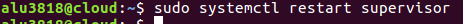

---

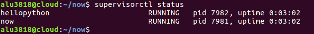

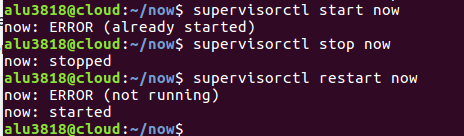

---

# Enlaces directos a las webs.

WEB | Enlace | :octocat:
 ------------ | ------------- | ------------
Primera | [Enlace](http://php.alu3818.me/)  | :+1:
Segunda | [Enlace](http://now.alu3818.me) | :+1:
